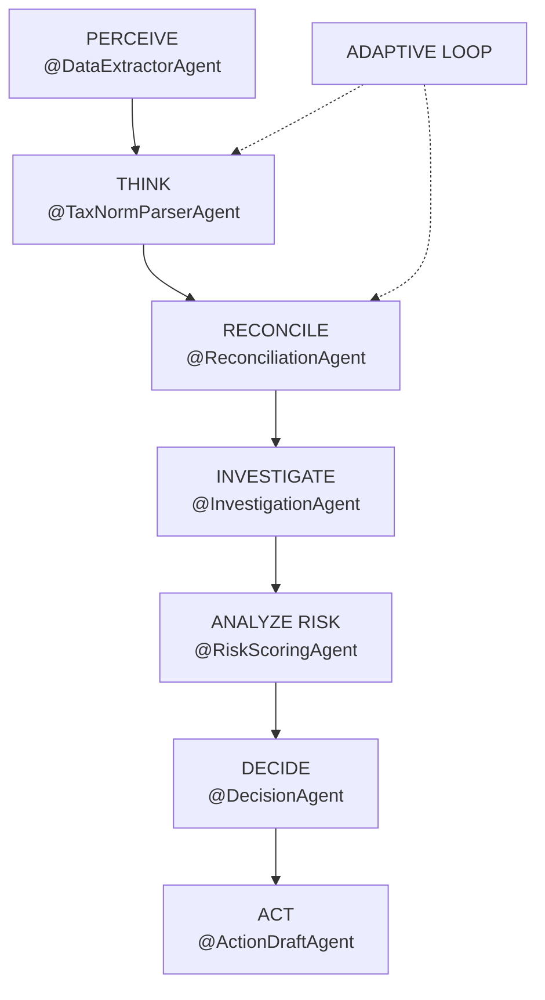

# GST ARCHANGEL
**AI Powered. Finance Perfected. GST Compliant.**

*An AI accountant that finds GST problems, decides what to do, takes action, and adapts.*

---

## THE PROBLEM
**GST Compliance Has a Data Problem and an Action Problem.**

Disconnected sources of financial data (Bank Statements, Purchase Invoices, Sales Invoices, GST Records like 2B/3B) lead to significant compliance gaps:
- Missing legitimate Input Tax Credit (ITC)
- Invoice mismatches and missing invoices
- GSTIN, HSN, or rate inconsistencies
- Excessive manual reconciliation work
- Difficulty in spotting which risks matter most

**The real problem isn't just finding errors — it's that workflows stop after detection.** Rule-based software flags issues, but human work starts exactly where detection ends. 

---

## OUR SOLUTION
**GST ARCHANGEL** goes further: Detect -> Understand -> Investigate -> Decide -> Act -> Adapt

It is an autonomous, multi-agent GST compliance system that reconciles financial data, identifies and investigates discrepancies, assesses ITC risk, and recommends actionable resolutions. It doesn't just detect discrepancies — it understands them and moves toward resolution.

> "Detection is not the end. It is the beginning of action."

---

## THE AGENTIC BRAIN
Archangel operates on **7 Specialized Agents + 1 Adaptive Loop**:

1. **PERCEIVE (@DataExtractorAgent):** OCR and extraction from bank and invoice documents.
2. **THINK (@TaxNormParserAgent):** Validates GSTIN, HSN codes, and tax rates.
3. **RECONCILE (@ReconciliationAgent):** 3-way match between bank, invoices, and GST records.
4. **INVESTIGATE (@InvestigationAgent):** Examines supplier history and compliance signals.
5. **ANALYZE RISK (@RiskScoringAgent):** Explainable risk scoring and ITC exposure quantification.
6. **DECIDE (@DecisionAgent):** Chooses the next action (request, reverse, escalate).
7. **ACT (@ActionDraftAgent):** Drafts the recommended communication for human review.
8. **ADAPT (Adaptive Loop):** Reassesses when new evidence arrives without manual restart.

---

## SYSTEM ARCHITECTURE

```mermaid
flowchart LR
    subgraph Inputs
    B[Bank Statements]
    P[Purchase Invoices]
    S[Sales Invoices]
    G[GST Records]
    end

    subgraph Intelligence Layer
    EX[Extraction] --> TN[Tax Norm Validation]
    TN --> REC[Reconciliation]
    REC --> INV[Investigation]
    INV --> RSK[Risk Analysis]
    RSK --> DEC[Decision Engine]
    DEC --> ACT[Action Generation]
    end

    subgraph Outputs
    O1[Risk Score & ITC Exposure]
    O2[Compliance Cases]
    O3[Recommended Actions]
    O4[Action Drafts]
    O5[Audit Trace]
    end

    Inputs --> EX
    ACT --> Outputs
```

---

## BENEFITS & IMPACT

**For Accountants:**
- Less manual reconciliation
- Faster discrepancy identification
- Explainable audit trails

**For Businesses:**
- Reduce potential ITC leakage
- Earlier risk identification
- Better compliance visibility

**For Compliance Teams:**
- Centralized case management
- Risk-based prioritization
- Action-ready recommendations

---

## TECHNOLOGY STACK

**Frontend:** Next.js, React, TypeScript, Tailwind CSS, Framer Motion, Lucide Icons  
**Backend:** FastAPI  
**AI / Agent Layer:** Specialized autonomous agents for extraction, reconciliation, risk, and decisioning  
**Data Layer:** Financial documents and structured transaction data  

---

## FUTURE SCOPE
- Real-time integrations with government GST portals
- Automated supplier response loops
- Continuous compliance monitoring
- Production-grade accounting integrations

   
  <strong>Find. Understand. Decide. Act. Adapt.</strong>

